# GlowDash konfigurációs fájl dokumentáció

Ez a dokumentum a GlowDash konfigurációs fájl (`config.yml`) felépítését és beállításait írja le. A `big-sample-config.yml` mintafájl minden lehetséges beállítást tartalmaz megjegyzésekkel. Alább minden szakasz és beállítás részletes magyarázata található.

---

## Legfelső szintű felépítés

A konfigurációs fájl egy YAML dokumentum egyetlen gyökérkulccsal:

```yaml
GlowDash:
  DashboardTitle: "My fancy GlowDash"
  StaticDirectory: "static"
  UserDirectory: "user"
  StateConfigDirectory: "config"
  ...
```

Minden konfigurációs opció a `GlowDash` kulcs alatt található.

---

## Globális beállítások

| Key                     | Type    | Default     | Description |
|-------------------------|---------|-------------|-------------|
| DashboardTitle          | string  | "GlowDash"  | A fő címsorban megjelenő cím. |
| LanguageCode            | string  | "en"        | A Glowdash felület nyelvi kódja |
| ReadWindInfo            | bool    | false       | Ha igaz, beolvassa a szélinformációt, és megjeleníti a címsorban. |
| WindInfoPollInterval    | int     | 3600        | Lekérdezési intervallum a szélinformációhoz (másodperc). |
| WeatherSource           | object  |             | Időjárás-szolgáltató beállításai (lásd lejjebb). |
| DebugLevel              | int     | 0           | Hibakeresési részletesség: 0 (néma), 1, 2, 3, 4... |
| StaticDirectory         | string  | "static"    | Statikus fájlok könyvtára (js, css, képek). |
| UserDirectory           | string  | "userstuff" | Felhasználói képek könyvtára. |
| LanguagesDirectory      | string  | "lang"      | Nyelvi fájlok könyvtára |
| StateConfigDirectory    | string  | "."         | A könyvtár, ahol az ütemezett feladatok mentésre kerülnek. |
| WebUseSSE               | int     | 0           | 0: kikapcsolva, 1: a böngészők az SSE szerverhez csatlakoznak. |
| WebSSEPort              | int     | 8080        | Az SSE szerver portja. |
| CommUseSSE              | int     | 0           | 0: kikapcsolva, 1: a GlowDash értesítési SSE szerver engedélyezése. |
| CommSSEPort             | int     | 8085        | A Hasses SSE szerver vezérlőcsatorna portja. |
| CommSSEHost             | string  | 127.0.0.1   | A Hasses SSE szerver hostja (alapértelmezett: 127.0.0.1). |
| WebServerPort           | string  | 80          | Webszerver port. |
| AssetVer                | string  | "114"       | Eszközverzió. |
| BackDevDialerTimeout    | int(ms) | 1200        | Eszközlekérdezés tárcsázó időtúllépése (ms). |
| BackDevKeepaliveTimeout | int(ms) | 1200        | Eszközlekérdezés keepalive időtúllépése (ms). |
| MaxLogLines             | int     | 128         | A naplóban megtartott sorok maximális száma |

### WeatherSource

| Key      | Type   | Default | Description |
|----------|--------|---------|-------------|
| Provider | string | ""      | Időjárás API szolgáltató (pl. weatherapi.com). |
| ApiKey   | string | ""      | API kulcs az időjárás-szolgáltatóhoz. |
| Location | string | ""      | Helyszín az időjárásadatokhoz. |

---

## Panelek

Minden panelnek rendelkeznie kell `PanelType` tulajdonsággal. Az elérhető paneltípusok:

- **Group**
- **Switch**
- **Shading**
- **Action**
- **Script**
- **Thermostat**
- **ThermostatSwitch**
- **Sensors**
- **Launch**
- **ScheduleShortcut**

Minden paneltípus eltérő tulajdonságkészletet fogad el. Alább minden paneltípus a releváns tulajdonságaival és egy mintakonfigurációval szerepel.

---

### PanelType: Group
- **Description:** Panelek csoportosítása egy aloldalra.
- **Sample Image:**

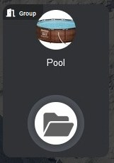

- **Properties:**
  - `PanelType: Group`: Ezt a panelt más panelek tárolójaként azonosítja.
  - `Title` (string): A panelen megjelenő cím.
  - `Thumbnail` (string): A panelen megjelenő kép (a felhasználói könyvtárból).
  - `CornerTitle` (string, optional): A panel sarkában megjelenő kis címke (opcionális).
  - `SubPageTo` (string): Az aloldal neve, amelyre ez a csoport hivatkozik.
  - `SubPage` (string, optional): Annak az aloldalnak a neve, ahol ez a panel megjelenik.
  - `Hide` (string, optional): Ha `yes`, a panel rejtett.
- **Sample:**
```yaml
- Title: Pool
  PanelType: Group
  Thumbnail: pool.jpg
  CornerTitle: Group
  SubPageTo: poolgrp
```

---

### PanelType: Switch
- **Description:** Egy relé vezérlése (pl. lámpa).
- **Sample Image:**

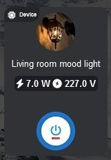

- **Properties:**
  - `PanelType: Switch`: Egy szabványos relét vezérel (például lámpát).
  - `Id` (string, optional): Opcionális egyedi azonosító a panelhez (ütemezett feladatokhoz vagy haladó funkciókhoz szükséges).
  - `Title` (string): A panelen megjelenő cím.
  - `EventTitle` (string, optional): Részletesebb cím az ütemezőszerkesztőben (alapértelmezésben `Title`).
  - `DeviceType` (string): Az eszköz típusa. Elfogadott értékek: `Shelly`, `ModbusTCP`, `Custom`.
  - `DeviceIp` (string): Az eszköz IP címe.
  - `InDeviceId` (int): Az eszköz belső azonosítója (pl. relészám).
  - `TcpPort` (int, optional): TCP port (Modbus alapértelmezett: `502`, Shelly alapértelmezett: `80`).
  - `UnitId` (int, optional): Modbus egységazonosító `DeviceType: ModbusTCP` esetén (alapértelmezett: `1`).
  - `Thumbnail` (string): A panelen megjelenő kép (a felhasználói könyvtárból).
  - `CustomQueryCode` (string, optional): Egyedi kód az eszköz állapotának lekérdezéséhez (a CommandLibrary-ben kell definiálni). Csak `DeviceType: Custom` esetén működik.
  - `CustomSetCode` (string, optional): Egyedi kód az eszköz állapotának beállításához (a CommandLibrary-ben kell definiálni). Csak `DeviceType: Custom` esetén működik.
  - `SubPage` (string, optional): Annak az aloldalnak a neve, ahol ez a panel megjelenik.
  - `Hide` (string, optional): Ha `yes`, a panel rejtett.
- **Sample:**
```yaml
- Id: ppid001
  Title: Facade lighting
  EventTitle: House facade lighting
  PanelType: Switch
  DeviceType: Shelly
  DeviceIp: 192.168.1.101
  InDeviceId: 0
  Thumbnail: facadelight.jpg

- Title: Room light
  PanelType: Switch
  DeviceType: ModbusTCP
  UnitId: 1
  DeviceIp: 192.168.1.102
  InDeviceId: 2
  Thumbnail: lamp01.jpg
```

---

### PanelType: Shading
- **Description:** Árnyékoló eszköz vezérlése (pl. Shelly redőny).
- **Sample Image:**

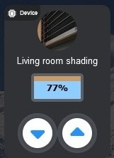

- **Properties:**
  - `PanelType: Shading`: Árnyékoló eszköz vezérlése (pl. Shelly cover vagy dual cover).
  - `Id` (string, optional): Opcionális egyedi azonosító a panelhez (ütemezett feladatokhoz vagy haladó funkciókhoz szükséges).
  - `Title` (string): A panelen megjelenő cím.
  - `DeviceType` (string): Az eszköz típusa. Elfogadott értékek: `Shelly`, `ModbusTCP`, `Custom`.
  - `DeviceIp` (string): Az eszköz IP címe.
  - `InDeviceId` (int): Az eszköz belső azonosítója (pl. redőnyszám).
  - `Thumbnail` (string): A panelen megjelenő kép (a felhasználói könyvtárból).
  - `EventTitle` (string, optional): Részletesebb cím az ütemezőszerkesztőben (alapértelmezésben `Title`).
  - `SubPage` (string, optional): Annak az aloldalnak a neve, ahol ez a panel megjelenik.
  - `Hide` (string, optional): Ha `yes`, a panel rejtett.
- **Sample:**
```yaml
- Title: Living room shading
  Id: ppidlrshade
  PanelType: Shading
  DeviceType: Shelly
  DeviceIp: 192.168.1.102
  InDeviceId: 0
  Thumbnail: shaderimg.jpg
```

---

### PanelType: Action
- **Description:** Egyedi művelet szkripttel.
- **Sample Image:**

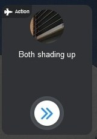

- **Properties:**
  - `PanelType: Action`: Egy egyedi műveletpanel, amely GlowDash szkriptet futtat.
  - `Id` (string, optional): Opcionális egyedi azonosító a panelhez (ütemezett feladatokhoz vagy haladó funkciókhoz szükséges).
  - `Title` (string): A panelen megjelenő cím.
  - `EventTitle` (string, optional): Részletesebb cím az ütemezőszerkesztőben (alapértelmezésben `Title`).
  - `DeviceType` (string, optional): Az eszköz típusa. Elfogadott értékek: `Shelly`, `ModbusTCP`, `Custom`.
  - `Thumbnail` (string): A panelen megjelenő kép (a felhasználói könyvtárból).
  - `Commands` (string, GlowDash script): A panel aktiválásakor végrehajtandó szkript.
  - `CommandFile` (string, optional): Külső fájl elérési útja a végrehajtandó szkripttel (ha meg van adva, felülírja a `Commands` értékét).
  - `SubPage` (string, optional): Annak az aloldalnak a neve, ahol ez a panel megjelenik.
  - `Hide` (string, optional): Ha `yes`, a panel rejtett.
- **Sample:**
```yaml
- Id: lralllampoff
  Title: App lamp off
  PanelType: Action
  DeviceType: Shelly
  Thumbnail: bulbs.jpg
  Commands: |
    RelatedPanel Switch 192.168.1.101 0
    RelatedPanel Switch 192.168.1.103 0
    RelatedPanel Switch 192.168.1.103 1
    CallHttp http://192.168.1.101/rpc/Switch.Set?id=0&on=false
    WaitMs 200
    CallHttp http://192.168.1.103/rpc/Switch.Set?id=0&on=false
    WaitMs 200
    CallHttp http://192.168.1.103/rpc/Switch.Set?id=1&on=false
    WaitMs 200
```

---

### PanelType: Sensors
- **Description:** Szenzorok aktuális értékeinek megjelenítése.
- **Sample Image:**

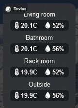

- **Properties:**
  - `PanelType: Sensors`: A szenzorok aktuális értékeinek megjelenítése.
  - `Id` (string): A panel egyedi azonosítója.
  - `Title` (string): A panelen megjelenő cím.
  - `DeviceType` (string): Az eszköz típusa (pl. smtherm daemon).
  - `DeviceIp` (string): Az eszköz IP címe.
  - `Sensors` (list of objects with `Name` and `Code`): Megjelenítendő szenzorok listája, mindegyiknél megjelenítési névvel és kódnévvel.
  - `SubPage` (string, optional): Annak az aloldalnak a neve, ahol ez a panel megjelenik.
  - `Hide` (string, optional): Ha `yes`, a panel rejtett.
- **Sample:**
```yaml
- Id: ppid002
  Title: Sensors
  PanelType: Sensors
  DeviceType: smtherm
  DeviceIp: 192.168.1.10
  Sensors:
    - Name: Living room
      Code: livingroom
    - Name: Bathroom
      Code: bathr
    - Name: Outside
      Code: outside
```

---

### PanelType: ScheduleShortcut
- **Description:** Gyorshivatkozás egy ütemezett feladathoz. Gyors vezérlési lehetőséget ad egy már létező ütemezéshez.
- **Sample Image:**

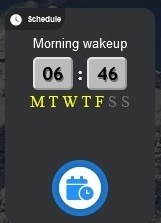

- **Properties:**
  - `PanelType: ScheduleShortcut`: Gyorshivatkozás panel egy ütemezett feladathoz.
  - `Id` (string): A panel egyedi azonosítója.
  - `ScheduleName` (string): A kapcsolni kívánt ütemezett feladat neve.
  - `SubPage` (string, optional): Annak az aloldalnak a neve, ahol ez a panel megjelenik.
  - `Hide` (string, optional): Ha `yes`, a panel rejtett.
- **Sample:**
```yaml
- Id: ppid003
  PanelType: ScheduleShortcut
  ScheduleName: "Morning wake up"
```

---

### PanelType: Thermostat
- **Description:** Termosztát eszköz vezérlése.
- **Sample Image:**

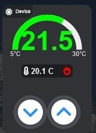

- **Properties:**
  - `PanelType: Thermostat`: Termosztát eszköz vezérlése.
  - `Id` (string): A panel egyedi azonosítója.
  - `Title` (string): A panelen megjelenő cím.
  - `EventTitle` (string, optional): Részletesebb cím az ütemezőszerkesztőben (alapértelmezésben `Title`).
  - `DeviceType` (string): Az eszköz típusa (pl. smtherm).
  - `DeviceIp` (string): Az eszköz IP címe.
  - `SubPage` (string, optional): Annak az aloldalnak a neve, ahol ez a panel megjelenik.
  - `Hide` (string, optional): Ha `yes`, a panel rejtett.
- **Sample:**
```yaml
- Id: ppidheaterset
  Title: Central heating
  PanelType: Thermostat
  DeviceType: smtherm
  DeviceIp: 192.168.1.10
```

---

### PanelType: ThermostatSwitch
- **Description:** Termosztát kapcsolóeszköz vezérlése.
- **Sample Image:**

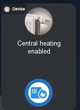

- **Properties:**
  - `PanelType: ThermostatSwitch`: Termosztát kapcsolóeszköz vezérlése.
  - `Id` (string): A panel egyedi azonosítója.
  - `Title` (string): A panelen megjelenő cím.
  - `DeviceType` (string): Az eszköz típusa (pl. smtherm).
  - `DeviceIp` (string): Az eszköz IP címe.
  - `Thumbnail` (string, optional): A panelen megjelenő kép (a felhasználói könyvtárból, opcionális).
  - `SubPage` (string, optional): Annak az aloldalnak a neve, ahol ez a panel megjelenik.
  - `Hide` (string, optional): Ha `yes`, a panel rejtett.
- **Sample:**
```yaml
- Id: ppidheatersetsw
  Title: Central heating enabled
  PanelType: ThermostatSwitch
  DeviceType: smtherm
  Thumbnail: heaterpanel.jpg
  DeviceIp: 192.168.1.10
```

---

### PanelType: ToggleSwitch
- **Description:** Kétállapotú kapcsoló (pl. elektromos/gáz vízmelegítő). Ez a kapcsoló két címet, bélyegképet és opcionális jelvényeket tud fogadni, és animált váltást biztosít a két állapot között.
- **Sample Image:**

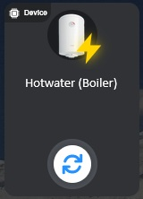

- **Properties:**
  - `PanelType: ToggleSwitch`: Kapcsolópanel kétállapotú eszközökhöz (pl. elektromos/gáz vízmelegítő).
  - `Id` (string): A panel egyedi azonosítója.
  - `Title` (string): A panelen megjelenő cím.
  - `TitleAlt` (string, optional): Alternatív cím, amely bekapcsolt állapotban jelenik meg (opcionális).
  - `EventTitle` (string, optional): Részletesebb cím az ütemezőszerkesztőben (alapértelmezésben `Title`).
  - `DeviceType` (string): Az eszköz típusa. Elfogadott értékek: `Shelly`, `ModbusTCP`, `Custom`.
  - `DeviceIp` (string): Az eszköz IP címe.
  - `InDeviceId` (int): Az eszköz belső azonosítója (pl. relészám).
  - `TcpPort` (int, optional):  TCP port (Modbus alapértelmezett: `502`, Shelly alapértelmezett: `80`).
  - `UnitId` (int, optional): Modbus egységazonosító `DeviceType: ModbusTCP` esetén (alapértelmezett: `1`).
  - `Thumbnail` (string): A panelen megjelenő kép (a felhasználói könyvtárból).
  - `ThumbnailAlt` (string, optional): Alternatív kép, amely bekapcsolt állapotban jelenik meg (opcionális).
  - `Badge` (string, optional): A kikapcsolt állapotban megjelenő jelvénypiktogram (opcionális).
  - `BadgeAlt` (string, optional): A bekapcsolt állapotban megjelenő jelvénypiktogram (opcionális).
  - `CustomQueryCode` (string, optional): Egyedi kód az eszköz állapotának lekérdezéséhez (a CommandLibrary-ben kell definiálni). Csak `DeviceType: Custom` esetén működik.
  - `CustomSetCode` (string, optional): Egyedi kód az eszköz állapotának beállításához (a CommandLibrary-ben kell definiálni). Csak `DeviceType: Custom` esetén működik.
  - `SubPage` (string, optional): Annak az aloldalnak a neve, ahol ez a panel megjelenik.
  - `Hide` (string, optional): Ha `yes`, a panel rejtett.
- **Sample:**
```yaml
- Id: tswid001
  Title: Hotwater maker (Electric boiler)
  TitleAlt: Hotwater maker (Gas heater)
  EventTitle: Hotwater maker
  PanelType: ToggleSwitch
  DeviceType: Custom
  DeviceIp: 192.168.1.177
  InDeviceId: 0
  Thumbnail: boiler.png
  ThumbnailAlt: gasheater.png
  Badge: "electric"
  BadgeAlt: "gas"
  CustomQueryCode: customquerysample
  CustomSetCode: customsetsample
```

---

### PanelType: Launch
- **Description:** Másik oldal indítása.
- **Sample Image:**

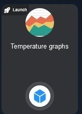

- **Properties:**
  - `PanelType: Launch`: Olyan panel, amely egy másik oldalt indít.
  - `Title` (string): A panelen megjelenő cím.
  - `Thumbnail` (string): A panelen megjelenő kép (a felhasználói könyvtárból).
  - `LaunchTo` (string): Az indítandó oldal neve a panel aktiválásakor.
  - `ButtonFontImageCssClass` (string, optional): CSS osztály az indítógomb ikonjához (alapértelmezett: fa-launch).
  - `SubPage` (string, optional): Annak az aloldalnak a neve, ahol ez a panel megjelenik.
  - `Hide` (string, optional): Ha `yes`, a panel rejtett.
- **Sample:**
```yaml
- Title: Temperature graphs
  PanelType: Launch
  Thumbnail: graph.jpg
  LaunchTo: graphpage
```

---

### PanelType: Script
**Description:** Egyedi szkript futtatása egy eszközön (pl. Shelly). Haladó automatizálási vagy eszközvezérlési célokra használható.
**Sample Image:**

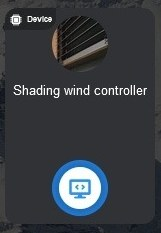

**Properties:**
  - `PanelType: Script`: Ezt a panelt szkriptfuttatóként azonosítja.
  - `Title` (string): A panelen megjelenő cím.
  - `DeviceType` (string): Az eszköz típusa. Elfogadott érték: `Shelly`.
  - `DeviceIp` (string): Az eszköz IP címe.
  - `ScriptName` (string): Az eszközön futtatandó szkript neve.
  - `Thumbnail` (string): A panelen megjelenő kép (a felhasználói könyvtárból).
  - `SubPage` (string, optional): Annak az aloldalnak a neve, ahol ez a panel megjelenik.
  - `Hide` (string, optional): Ha `yes`, a panel rejtett.
**Sample:**
```yaml
- Title: Wind guard script
  SubPage: shadergrp
  PanelType: Script
  DeviceType: Shelly
  DeviceIp: 192.168.1.220
  ScriptName: WindCheck
  Thumbnail: windcheck.jpg
```

---

## Oldalak

Minden oldalnak rendelkeznie kell `PageType` tulajdonsággal. Az elérhető oldaltípusok (a mintakonfiguráció szerint):

- **Console**
- **SensorGraph**
- **SensorStats**
- **ScheduleEdit**

Minden oldaltípus eltérő tulajdonságkészletet fogad el. Alább minden oldaltípus a releváns tulajdonságaival és egy mintakonfigurációval szerepel.

### PageType: Console
- **Description:** Glowdash belső konzol.
- **Properties:**
  - `PageType: Console`
  - `Title` (string, optional) Az címsorban megjelenő cím
  - `PageName` (string) Ez a név erre a panelre hivatkozik indítópanel létrehozásakor
- **Sample:**
```yaml
- Title: Glowdash console
  PageName: glowdashconsole
  PageType: SensorGraph
```

---

### PageType: SensorGraph
- **Description:** Szenzoradatok megjelenítése grafikonként.
- **Properties:**
  - `PageType: SensorGraph`
  - `Title` (string, optional) Az címsorban megjelenő cím
  - `PageName` (string) (string) Ez a név erre a panelre hivatkozik indítópanel létrehozásakor
  - `DeviceType` (string) Eszköztípus. Jelenleg csak a "smtherm" eszköz támogatott.
  - `DeviceIp` (string) Az eszköz IP címe.
  - `DeviceTcpPort` (int, optional): Az eszköz TCP portja (alapértelmezett: 5017, smtherm eszközöknél).
  - `Sensors` (list of objects with `Name` and `Code`)
- **Sample:**
```yaml
- PageName: graphpage
  PageType: SensorGraph
  DeviceType: smtherm
  DeviceIp: 192.168.1.10
  Sensors:
    - Name: Living room
      Code: livingroom
    - Name: Bathroom
      Code: bathr
    - Name: Outside
      Code: outside
```

---

### PageType: SensorStats
- **Description:** Szenzorstatisztikák és számlálók megjelenítése.
- **Properties:**
  - `PageType: SensorStats`
  - `Title` (string, optional) Az címsorban megjelenő cím
  - `PageName` (string) Ez a név erre a panelre hivatkozik indítópanel létrehozásakor
  - `DeviceType` (string) Eszköztípus. Jelenleg csak a "smtherm" eszköz támogatott.
  - `DeviceIp` (string) Az eszköz IP címe.
  - `Sensors` (list of objects with `Name` and `Code`)
  - `ShowCounter` (string, optional: "hardwired", "both", "resetable")
- **Sample:**
```yaml
- PageName: statpage
  PageType: SensorStats
  DeviceType: smtherm
  ShowCounter: both
  DeviceIp: 192.168.1.10
  Sensors:
    - Name: Living room
      Code: livingroom
    - Name: Bathroom
      Code: bathr
    - Name: Outside
      Code: outside
```

---

### PageType: ScheduleEdit
- **Description:** Ütemezőszerkesztő felületet biztosít.
- **Properties:**
  - `PageType: ScheduleEdit`
  - `Title` (string, optional) Az címsorban megjelenő cím
  - `PageName` (string) Ez a név erre a panelre hivatkozik indítópanel létrehozásakor
- **Sample:**
```yaml
- Title: Scheduled tasks
  PageType: ScheduleEdit
  PageName: schedpage
```

---

## CommandLibrary

Újrahasznosítható szkriptrészleteket definiál panelekben való használathoz. Minden bejegyzés tartalma:

| Key   | Type   | Description |
|-------|--------|-------------|
| Name  | string | A szkript neve. |
| Code  | string | Szkriptkód (GlowDash szkriptnyelv). |

---

## Példa

A teljes, kommentált példát minden opcióval és megjegyzéssel lásd a `big-sample-config.yml` fájlban.

---

## Megjegyzések
- Minden string érték használhat változóhelyettesítést `{{variablename}}` formában.
- A behúzás és a YAML szintaxis fontos; kövesd pontosan a mintafájlt.
- Egyes opciók csak bizonyos paneltípusoknál érvényesek.
- Egyedi műveletekhez lásd a GlowDash szkriptnyelv dokumentációját.
