# GlowDash Configuration File Documentation

This document describes the structure and options of the GlowDash configuration file (`config.yml`). The sample file `big-sample-config.yml` contains all possible settings with comments. Below is a detailed explanation of each section and option.

---

## Top-Level Structure

The configuration file is a YAML document with a single root key:

```yaml
GlowDash:
  DashboardTitle: "My fancy GlowDash"
  StaticDirectory: "static"
  UserDirectory: "user"
  StateConfigDirectory: "config"
  ...
```

All configuration options are nested under the `GlowDash` key.

---

## Global Settings

| Key                     | Type    | Default     | Description |
|-------------------------|---------|-------------|-------------|
| DashboardTitle          | string  | "GlowDash"  | Title shown in the main title line. |
| ReadWindInfo            | bool    | false       | If true, reads wind information and shows it in the title line. |
| WindInfoPollInterval    | int     | 3600        | Poll interval for wind info (seconds). |
| WeatherSource           | object  |             | Weather provider settings (see below). |
| DebugLevel              | int     | 0           | Debug verbosity: 0 (silent), 1, 2, 3, 4... |
| StaticDirectory         | string  | ""          | Directory for static files (js, css, images). |
| UserDirectory           | string  | ""          | Directory for user images. |
| StateConfigDirectory    | string  | "."         | Directory where scheduled tasks are saved. |
| WebUseSSE               | int     | 0           | 0: disabled, 1: browsers connect to SSE server. |
| WebSSEPort              | int     | 8080        | Port for SSE server. |
| CommUseSSE              | int     | 0           | 0: disabled, 1: enable GlowDash notify SSE server. |
| CommSSEPort             | int     | 8085        | Port for Hasses SSE server control channel. |
| CommSSEHost             | string  | 127.0.0.1   | Host for Hasses SSE server (default: 127.0.0.1). |
| WebServerPort           | string  | 80          | Web server port. |
| AssetVer                | string  | "114"       | Asset version. |
| BackDevDialerTimeout    | int(ms) | 1200        | Device query dialer timeout (ms). |
| BackDevKeepaliveTimeout | int(ms) | 1200        | Device query keepalive timeout (ms). |

### WeatherSource

| Key      | Type   | Default | Description |
|----------|--------|---------|-------------|
| Provider | string | ""      | Weather API provider (e.g., weatherapi.com). |
| ApiKey   | string | ""      | API key for the weather provider. |
| Location | string | ""      | Location for weather data. |

---

## Panels

All panels must have a `PanelType` property. The available panel types are:

- **Group**
- **Switch**
- **Shading**
- **Action**
- **Script**
- **Thermostat**
- **ThermostatSwitch**
- **Sensors**
- **Launch**
- **ScheduleShortcut**

Each panel type accepts a different set of properties. Below, each panel type is listed with its relevant properties and a sample configuration.

---

### PanelType: Group
- **Description:** Groups panels together into a subpage.
- **Sample Image:**

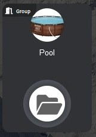

- **Properties:**
  - `PanelType: Group`: Identifies this panel as a container for other panels.
  - `Title` (string): The title displayed on the group panel.
  - `Thumbnail` (string): The image displayed for the group panel (from the user directory).
  - `CornerTitle` (string, optional): A small label displayed in the panel's corner (optional).
  - `SubPageTo` (string): The name of the subpage to which this group links.
- **Sample:**
```yaml
- Title: Pool
  PanelType: Group
  Thumbnail: pool.jpg
  CornerTitle: Group
  SubPageTo: poolgrp
```

---

### PanelType: Switch
- **Description:** Controls a relay (e.g., lamp).
- **Sample Image:**

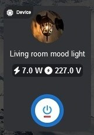

- **Properties:**
  - `PanelType: Switch`: Controls a standard relay (for example, a lamp).
  - `Id` (string, optional): Optional unique identifier for the panel (required for scheduled tasks or advanced features).
  - `Title` (string): The title displayed on the panel.
  - `EventTitle` (string, optional): Verbose title used in the schedule editor (defaults to `Title`).
  - `DeviceType` (string): The type of device (e.g., Shelly).
  - `DeviceIp` (string): The IP address of the device.
  - `InDeviceId` (int): Internal ID of the device (e.g., relay number).
  - `Thumbnail` (string): The image displayed for the panel (from the user directory).
  - `CustomQueryCode` (string, optional): Custom code to query the state of the device (must be defined in CommandLibrary).
  - `CustomSetCode` (string, optional): Custom code to set the state of the device (must be defined in CommandLibrary).
- **Sample:**
```yaml
- Id: ppid001
  Title: Facade lighting
  EventTitle: House facade lighting
  PanelType: Switch
  DeviceType: Shelly
  DeviceIp: 192.168.1.101
  InDeviceId: 0
  Thumbnail: facadelight.jpg
```

---

### PanelType: Shading
- **Description:** Controls a shading device (e.g., Shelly cover).
- **Sample Image:**

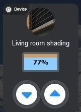

- **Properties:**
  - `PanelType: Shading`: Controls a shading device (e.g., Shelly cover or dual cover).
  - `Id` (string, optional): Optional unique identifier for the panel (required for scheduled tasks or advanced features).
  - `Title` (string): The title displayed on the panel.
  - `DeviceType` (string): The type of device (e.g., Shelly).
  - `DeviceIp` (string): The IP address of the device.
  - `InDeviceId` (int): Internal ID of the device (e.g., cover number).
  - `Thumbnail` (string): The image displayed for the panel (from the user directory).
- **Sample:**
```yaml
- Title: Living room shading
  Id: ppidlrshade
  PanelType: Shading
  DeviceType: Shelly
  DeviceIp: 192.168.1.102
  InDeviceId: 0
  Thumbnail: shaderimg.jpg
```

---

### PanelType: Action
- **Description:** Custom action with a script.
- **Sample Image:**

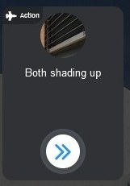

- **Properties:**
  - `PanelType: Action`: A custom action panel that runs a GlowDash script.
  - `Id` (string, optional): Optional unique identifier for the panel (required for scheduled tasks or advanced features).
  - `Title` (string): The title displayed on the panel.
  - `DeviceType` (string, optional): The type of device (optional, e.g., Shelly).
  - `Thumbnail` (string): The image displayed for the panel (from the user directory).
  - `Commands` (string, GlowDash script): The script to execute when the panel is activated.
  - `CommandFile` (string, optional): Path to an external file containing the script to execute (overrides `Commands` if provided).
- **Sample:**
```yaml
- Id: lralllampoff
  Title: App lamp off
  PanelType: Action
  DeviceType: Shelly
  Thumbnail: bulbs.jpg
  Commands: |
    RelatedPanel Switch 192.168.1.101 0
    RelatedPanel Switch 192.168.1.103 0
    RelatedPanel Switch 192.168.1.103 1
    CallHttp http://192.168.1.101/rpc/Switch.Set?id=0&on=false
    WaitMs 200
    CallHttp http://192.168.1.103/rpc/Switch.Set?id=0&on=false
    WaitMs 200
    CallHttp http://192.168.1.103/rpc/Switch.Set?id=1&on=false
    WaitMs 200
```

---

### PanelType: Sensors
- **Description:** Shows current values of sensors.
- **Sample Image:**

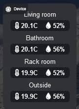

- **Properties:**
  - `PanelType: Sensors`: Displays the current values of sensors.
  - `Id` (string): Unique identifier for the panel.
  - `Title` (string): The title displayed on the panel.
  - `DeviceType` (string): The type of device (e.g., smtherm daemon).
  - `DeviceIp` (string): The IP address of the device.
  - `Sensors` (list of objects with `Name` and `Code`): List of sensors to display, each with a display name and a code name.
- **Sample:**
```yaml
- Id: ppid002
  Title: Sensors
  PanelType: Sensors
  DeviceType: smtherm
  DeviceIp: 192.168.1.10
  Sensors:
    - Name: Living room
      Code: livingroom
    - Name: Bathroom
      Code: bathr
    - Name: Outside
      Code: outside
```

---

### PanelType: ScheduleShortcut
- **Description:** Shortcut to a scheduled task. Gives quick control possibilities to an already exists schedule.
- **Sample Image:**

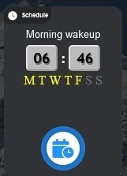

- **Properties:**
  - `PanelType: ScheduleShortcut`: A shortcut panel to a scheduled task.
  - `Id` (string): Unique identifier for the panel.
  - `ScheduleName` (string): The name of the scheduled task to link to.
- **Sample:**
```yaml
- Id: ppid003
  PanelType: ScheduleShortcut
  ScheduleName: "Morning wake up"
```

---

### PanelType: Thermostat
- **Description:** Controls a thermostat device.
- **Sample Image:**

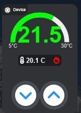

- **Properties:**
  - `PanelType: Thermostat`: Controls a thermostat device.
  - `Id` (string): Unique identifier for the panel.
  - `Title` (string): The title displayed on the panel.
  - `DeviceType` (string): The type of device (e.g., smtherm).
  - `DeviceIp` (string): The IP address of the device.
- **Sample:**
```yaml
- Id: ppidheaterset
  Title: Central heating
  PanelType: Thermostat
  DeviceType: smtherm
  DeviceIp: 192.168.1.10
```

---

### PanelType: ThermostatSwitch
- **Description:** Controls a thermostat switch device.
- **Sample Image:**

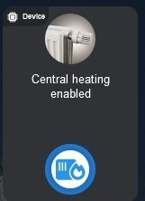

- **Properties:**
  - `PanelType: ThermostatSwitch`: Controls a thermostat switch device.
  - `Id` (string): Unique identifier for the panel.
  - `Title` (string): The title displayed on the panel.
  - `DeviceType` (string): The type of device (e.g., smtherm).
  - `DeviceIp` (string): The IP address of the device.
  - `Thumbnail` (string, optional): The image displayed for the panel (from the user directory, optional).
- **Sample:**
```yaml
- Id: ppidheatersetsw
  Title: Central heating enabled
  PanelType: ThermostatSwitch
  DeviceType: smtherm
  Thumbnail: heaterpanel.jpg
  DeviceIp: 192.168.1.10
```

---

### PanelType: ToggleSwitch
- **Description:** Switch with two states (e.g., electric/gas water heater). This switch can receive two title, thumbnail image and optional badges and do animated changing between two states.
- **Sample Image:**

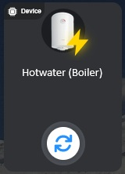

- **Properties:**
  - `PanelType: ToggleSwitch`: A switch panel for devices with two states (e.g., electric/gas water heater).
  - `Id` (string): Unique identifier for the panel.
  - `Title` (string): The title displayed on the panel.
  - `TitleAlt` (string, optional): Alternate title text displayed when the switch is on (optional).
  - `EventTitle` (string, optional): Verbose title used in the schedule editor (defaults to `Title`).
  - `DeviceType` (string): The type of device (e.g., Shelly).
  - `DeviceIp` (string): The IP address of the device.
  - `InDeviceId` (int): Internal ID of the device (e.g., relay number).
  - `Thumbnail` (string): The image displayed for the panel (from the user directory).
  - `ThumbnailAlt` (string, optional): Alternate image displayed when the switch is on (optional).
  - `Badge` (string, optional): Badge pictogram displayed when the switch is off (optional).
  - `BadgeAlt` (string, optional): Badge pictogram displayed when the switch is on (optional).
  - `CustomQueryCode` (string, optional): Custom code to query the state of the device (must be defined in CommandLibrary).
  - `CustomSetCode` (string, optional): Custom code to set the state of the device (must be defined in CommandLibrary).
- **Sample:**
```yaml
- Id: tswid001
  Title: Hotwater maker (Electric boiler)
  TitleAlt: Hotwater maker (Gas heater)
  EventTitle: Hotwater maker
  PanelType: ToggleSwitch
  DeviceType: Shelly
  DeviceIp: 192.168.1.177
  InDeviceId: 0
  Thumbnail: boiler.png
  ThumbnailAlt: gasheater.png
  Badge: "electric"
  BadgeAlt: "gas"
  CustomQueryCode: customquerysample
  CustomSetCode: customsetsample
```

---

### PanelType: Launch
- **Description:** Launches another page.
- **Sample Image:**

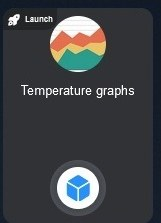

- **Properties:**
  - `PanelType: Launch`: A panel that launches another page.
  - `Title` (string): The title displayed on the panel.
  - `Thumbnail` (string): The image displayed for the panel (from the user directory).
  - `LaunchTo` (string): The name of the page to launch when this panel is activated.
  - `ButtonFontImageCssClass` (string, optional): CSS class for the launch button icon (default: fa-launch).
- **Sample:**
```yaml
- Title: Temperature graphs
  PanelType: Launch
  Thumbnail: graph.jpg
  LaunchTo: graphpage
```

---

### PanelType: Script
**Description:** Runs a custom script on a device (e.g., Shelly). Used for advanced automation or device control.
**Sample Image:**

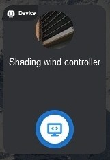

**Properties:**
  - `PanelType: Script`: Identifies this panel as a script runner.
  - `Title` (string): The title displayed on the panel.
  - `SubPage` (string, optional): The name of the subpage this panel links to (optional).
  - `DeviceType` (string): The type of device (e.g., Shelly).
  - `DeviceIp` (string): The IP address of the device.
  - `ScriptName` (string): The name of the script to run on the device.
  - `Thumbnail` (string): The image displayed for the panel (from the user directory).
**Sample:**
```yaml
- Title: Wind guard script
  SubPage: shadergrp
  PanelType: Script
  DeviceType: Shelly
  DeviceIp: 192.168.1.220
  ScriptName: WindCheck
  Thumbnail: windcheck.jpg
```

---

## Pages

All pages must have a `PageType` property. The available page types (as seen in the sample config) include:

- **SensorGraph**
- **SensorStats**
- **ScheduleEdit**

Each page type accepts a different set of properties. Below, each page type is listed with its relevant properties and a sample configuration.

---

### PageType: SensorGraph
- **Description:** Displays sensor data as graphs.
- **Properties:**
  - `PageName` (string)
  - `PageType: SensorGraph`
  - `DeviceType` (string)
  - `DeviceIp` (string)
  - `DeviceTcpPort` (int, optional): TCP port of the device (default: 5017, for smtherm devices).
  - `Sensors` (list of objects with `Name` and `Code`)
- **Sample:**
```yaml
- PageName: graphpage
  PageType: SensorGraph
  DeviceType: smtherm
  DeviceIp: 192.168.1.10
  Sensors:
    - Name: Living room
      Code: livingroom
    - Name: Bathroom
      Code: bathr
    - Name: Outside
      Code: outside
```

---

### PageType: SensorStats
- **Description:** Displays sensor statistics and counters.
- **Properties:**
  - `PageName` (string)
  - `PageType: SensorStats`
  - `DeviceType` (string)
  - `DeviceIp` (string)
  - `Sensors` (list of objects with `Name` and `Code`)
  - `ShowCounter` (string, optional: "hardwired", "both", "resetable")
- **Sample:**
```yaml
- PageName: statpage
  PageType: SensorStats
  DeviceType: smtherm
  ShowCounter: both
  DeviceIp: 192.168.1.10
  Sensors:
    - Name: Living room
      Code: livingroom
    - Name: Bathroom
      Code: bathr
    - Name: Outside
      Code: outside
```

---

### PageType: ScheduleEdit
- **Description:** Provides a schedule editor interface.
- **Properties:**
  - `Title` (string, optional)
  - `PageType: ScheduleEdit`
  - `PageName` (string)
- **Sample:**
```yaml
- Title: Scheduled tasks
  PageType: ScheduleEdit
  PageName: schedpage
```

---

## CommandLibrary

Defines reusable script snippets for use in panels. Each entry has:

| Key   | Type   | Description |
|-------|--------|-------------|
| Name  | string | Name of the script. |
| Code  | string | Script code (GlowDash script language). |

---

## Example

See `big-sample-config.yml` for a complete, annotated example with all options and comments.

---

## Notes
- All string values can use variable substitution with `{{variablename}}`.
- Indentation and YAML syntax are important; follow the sample file closely.
- Some options are only valid for certain panel types.
- For custom actions, see the GlowDash script language documentation.
